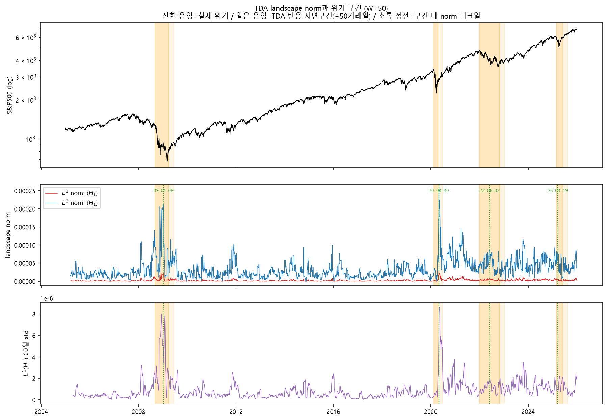
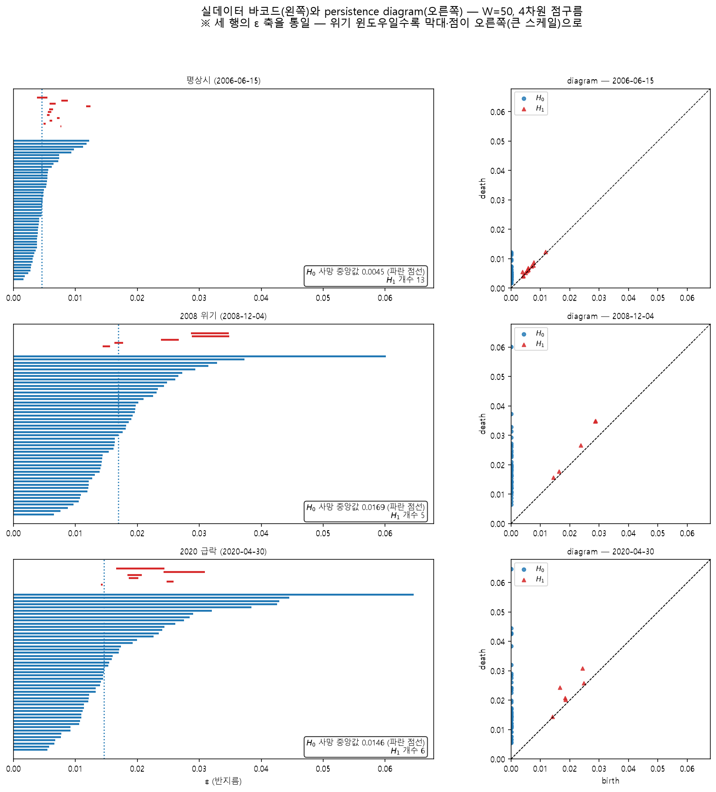

# S&P 500 방향 예측 × 위상 데이터 분석(TDA)

> 4개 미국 지수의 수익률로 만든 점구름의 **위상 구조(persistent homology)** 가
> 다음 거래일 S&P 500의 상승·하락 예측에 도움이 되는가?

2026 여름방학 프로젝트(TDA). 같은 데이터·같은 분할·같은 평가 함수 위에서
배깅·부스팅·선형 모델 6종이 **동일한 피처 조합 실험(①~⑥)** 을 돌려,
TDA 피처의 기여를 모델에 상관없이 비교했습니다.

<p align="center">
  
  <br><sub>TDA landscape norm (H₁) 시계열 — 2008 금융위기·2020 코로나 급락 구간에서 뚜렷하게 튄다</sub>
</p>

---

## 핵심 결과

검증(valid) 구간 782거래일, 다수 클래스 기준선 정확도 0.5409. 비교마다 AUC 차이에 **95% 부트스트랩 신뢰구간**(2,000회)을 붙였습니다.

1. **TDA를 더해도 트리 모델은 유의하게 좋아지지 않았다.**
   ① 베이스라인 → ③ +TDA의 ΔAUC 신뢰구간이 RandomForest·Bagging·GBM·XGBoost **4개 모두 0을 포함**.
2. **선형 모델은 TDA를 더하면 오히려 유의하게 나빠졌다.**
   Ridge −0.035, Lasso −0.032 (둘 다 CI가 0 미만).
3. **TDA 8종 중 변동성과 덜 겹치는 5종만 쓰면 나아졌다.**
   ④ TDA만(8) → ⑥ 저중복 TDA(5): Bagging +0.040, GBM +0.040 (유의).
   변동성과 중복되는 피처가 신호를 희석한다는 가설과 부합.
4. **TDA가 기존 변동성 피처 이상의 정보를 준다는 증거는 찾지 못했다.**
   ⑤ 변동성만(4) → ④ TDA만(8) 비교에서 개선된 모델 없음 (Lasso는 유의하게 악화).
5. **TDA norm과 변동성의 겹침은 거의 전부 점구름 '크기' 때문이다.**
   `TDA_L1_H0` 과 20일 변동성의 상관 0.81이, 노름이 점구름 스케일(RMS 쌍거리)에 따라 커지는
   실측 지수(k = 1.47)로 나누면 0.13으로 떨어짐. landscape norm 5종 모두 0.13 이하.
   (k를 같은 train 데이터에서 추정해 나눈 값이라 약간 순환적)
   크기를 MST 평균 간선으로 재면 H₀ 노름은 이론 스케일링(L¹ 2.0, L² 1.5)과 맞고,
   H₁만 이론보다 느리게 커짐(L¹ 1.46) → [`02_tda_features.ipynb`](notebooks/02_tda_features.ipynb) §2-1.

모든 모델의 AUC가 0.47~0.56에 머무름 — 일간 방향 예측 자체가 매우 어려운 과제라는 점도 함께 확인했습니다.

### 모델 × 실험 ROC-AUC (valid)

| 실험 | 피처 수 | RandomForest | Bagging | GBM | XGBoost | Ridge | Lasso |
|---|--:|--:|--:|--:|--:|--:|--:|
| ① 베이스라인 | 22 | 0.546 | 0.547 | **0.561** | 0.530 | 0.516 | 0.523 |
| ② +교차지수 | 34 | 0.527 | 0.498 | 0.542 | 0.536 | 0.514 | 0.516 |
| ③ +TDA | 30 | **0.556** | 0.546 | 0.551 | 0.541 | 0.481 | 0.491 |
| ②+③ 전부 | 42 | 0.538 | 0.521 | 0.540 | 0.533 | 0.486 | 0.493 |
| ④ TDA만 | 8 | 0.481 | 0.477 | 0.486 | 0.527 | 0.474 | 0.472 |
| ④′ 교차지수만 | 12 | 0.487 | 0.507 | 0.508 | 0.509 | 0.513 | 0.521 |
| ⑤ 변동성만 | 4 | 0.514 | 0.505 | 0.505 | 0.521 | 0.518 | 0.534 |
| ⑥ 저중복 TDA | 5 | 0.508 | 0.517 | 0.526 | **0.544** | 0.494 | 0.484 |

Ridge·Lasso는 수익률 회귀 모델이고, 예측값을 0 기준으로 잘라 방향을 판정했습니다.
XGBoost는 모든 실험에서 다수 클래스만 예측해(balanced accuracy 0.5) 정확도는 기준선과 같고 AUC만 비교할 수 있습니다.
정확도·F1·ΔAUC 신뢰구간 전체는 [`results/results_summary.xlsx`](results/results_summary.xlsx) 에 있습니다.

---

## 방법

### 데이터와 설계

| 항목 | 내용 |
|---|---|
| 대상 | S&P 500 (`^GSPC`), 일간 |
| 기간 | 2005-01-01 ~ 2025-12-31 (2008 금융위기·2020 코로나·2022 약세장·2025 관세 충격 포함) |
| 타깃 | 다음 거래일 로그수익률의 부호 (상승 1 / 하락 0) |
| 분할 | 시간 순 Train 70 / Valid 15 / Test 15, 셔플 없음 |
| | Train 2005-03 ~ 2019-10 (3,654) · Valid 2019-10 ~ 2022-11 (782) · Test 2022-11 ~ 2025-12 (783) |
| 기준선 | 다수 클래스, 모멘텀(전일 방향) |

**기본 피처 22종** — 1·5·10·20·60일 수익률, 수익률 lag, 갭·일중 수익률, 고저폭, 종가 위치,
이동평균 괴리율(5·10·20·60), 변동성(5·10·20·60), 거래량 z-score.
가격 수준은 비정상 시계열이라 쓰지 않고 수익률·비율만 사용했습니다.
모든 피처는 과거~당일 값만 쓰고 타깃만 미래를 봅니다 (누수 방지).

### TDA 피처 (Gidea & Katz, 2018 방식)

```
S&P500 · DJIA · NASDAQ · Russell2000 일간 로그수익률
        │  날마다 4차원 점 1개
        ▼
길이 50일 슬라이딩 윈도우  →  윈도우마다 50개 점의 4D 점구름
        ▼
Vietoris–Rips persistent homology  (H₀ 연결성분 · H₁ 루프)
        ▼
persistence landscape의 L¹·L² norm + persistence entropy  →  피처 8종
```

| 피처 | 의미 |
|---|---|
| `TDA_L1_H0`, `TDA_L1_H1` | landscape L¹ norm — 위상 구조의 총량 |
| `TDA_L2_H0`, `TDA_L2_H1` | landscape L² norm — 큰 구조에 더 민감 |
| `TDA_PE_H0`, `TDA_PE_H1` | persistence entropy — 수명 분포의 불균일도 |
| `TDA_L1_H1_diff1` | L¹(H₁)의 1일 변화 |
| `TDA_L1_H1_std20` | L¹(H₁)의 20일 롤링 표준편차 — 논문의 "폭락 전 분산 증가" |

TDA가 좋아 보일 때 그게 위상 덕분인지 **단지 다른 지수를 봐서인지** 가르기 위해,
같은 4개 지수에서 **교차지수 피처 12종**(초과수익률, 시장 폭, 지수 간 상관 등)도 따로 만들어 대조군으로 썼습니다.

<p align="center">
  
  <br><sub>평상시 · 2008 · 2020 윈도우의 바코드와 persistence diagram — 위기 때 막대가 길어진다</sub>
</p>

### 실험 매트릭스

모델마다 하이퍼파라미터는 ①에서 정한 값으로 고정하고, **피처 조합만** 바꿨습니다.

| 실험 | 피처 | 묻는 것 |
|---|---|---|
| ① 베이스라인 | 기본 22 | 기준 |
| ② +교차지수 | 22 + 12 | 다른 지수 정보 자체의 기여 |
| ③ +TDA | 22 + 8 | TDA의 기여 (②와 짝) |
| ②+③ 전부 | 22 + 20 | 둘 다 |
| ④ TDA만 | 8 | TDA 단독 |
| ④′ 교차지수만 | 12 | 교차지수 단독 |
| ⑤ 변동성만 | 4 | TDA가 변동성의 재탕인지 가르는 대조군 |
| ⑥ 저중복 TDA | 5 | TDA 중 `Volatility_20` 과 \|상관\| < 0.5 인 것만 |

---

## 저장소 구조

```
sp500-tda-prediction/
├── notebooks/
│   ├── 01_preprocessing.ipynb        팀 공통 전처리 → GSPC_arrays_*.npz, baselines.csv
│   ├── 02_tda_features.ipynb         TDA·교차지수 피처 생산, 시각화, RandomForest 실험
│   ├── 03_model_xgboost.ipynb        XGBoost 실험
│   ├── 04_model_bagging_gbm.ipynb    Bagging·GBM 튜닝과 실험 (Google Colab)
│   ├── common_eval.py                팀 공통 실험 코드 — 데이터 결합·evaluate()·실험 ①~⑥·부트스트랩 CI
│   │
│   ├── raw_snapshot_{GSPC,DJI,IXIC,RUT}_20050101_20260101.csv   원시 주가 스냅샷
│   ├── GSPC_arrays_20050101_20260101.npz                        전처리 결과 (분할 완료)
│   ├── tda_features_w50.csv                                     TDA 피처 8종
│   ├── cross_index_features.csv                                 교차지수 피처 12종
│   └── baselines.csv                                            기준선 성능
├── figures/                          README·발표용 그림
├── results/
│   ├── results_summary.xlsx          전 모델 성능표 + ΔAUC 95% CI 통합본
│   ├── matrix_xgboost.csv
│   └── delta_auc_ci_ridge_lasso.csv
└── requirements.txt
```

노트북들이 서로의 산출물을 **같은 폴더에서 상대경로로** 읽기 때문에 데이터 파일을 `notebooks/` 안에 함께 두었습니다.

---

## 실행 방법

```bash
conda create -n sp500-tda python=3.11
conda activate sp500-tda
pip install -r requirements.txt
jupyter lab notebooks/
```

`notebooks/` 에서 **01 → 02 → 03 / 04** 순서로 실행합니다.

- 주가 스냅샷이 포함되어 있어 **다운로드 없이** 커밋된 수치를 그대로 재현합니다.
  yfinance는 과거 데이터를 소급 수정하기 때문에 새로 받으면 값이 미세하게 달라질 수 있어, 스냅샷을 고정해 두었습니다.
- 01·02는 스냅샷이 없을 때만 yfinance로 새로 받습니다.
- `03_model_xgboost.ipynb` 의 앞부분은 전처리 **초기 버전**(기간 ~2024-12-31)으로 단독 XGBoost를 돌린 기록입니다.
  기간 없는 파일명(`raw_snapshot_GSPC.csv`)을 yfinance로 새로 받고, **`baselines.csv` 를 초기 기간 값으로 덮어씁니다.**
  위 결과표의 수치는 후반부 실험 매트릭스(공통 npz 사용)에서 나온 것입니다. 덮어써진 `baselines.csv` 는 01을 다시 돌리면 복구됩니다.
- `04_model_bagging_gbm.ipynb` 는 **Google Colab용**입니다. 경로가 `/content/drive/MyDrive/` 로 되어 있으니,
  드라이브에 `notebooks/` 의 데이터 파일을 올리거나 경로를 로컬로 바꿔서 실행하세요.
- TDA 계산(`giotto-tda`)은 윈도우 약 5,000개에 수십 초 걸립니다.

---

## 향후 과제

TDA 전공 교수님 자문을 바탕으로 H₁ 중심 해석, 피처 제거 재실험, extended persistence 확장을 계획 중입니다.
→ [`docs/feedback_and_next_steps.md`](docs/feedback_and_next_steps.md)

---

## 참고문헌

- Gidea, M., & Katz, Y. (2018). Topological data analysis of financial time series: Landscapes of crashes. *Physica A*, 491, 820–834.
- Tauzin, G. et al. (2021). giotto-tda: A topological data analysis toolkit for machine learning and data exploration. *JMLR*, 22(39), 1–6.
